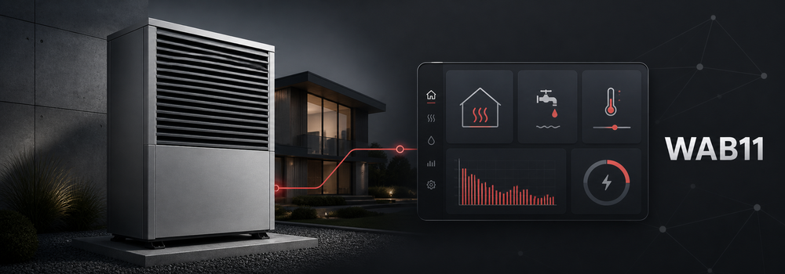

[![hacs][hacsbadge]][hacs]

Weishaupt WAB11 is a HACS-installable Home Assistant integration for Weishaupt heat pumps that expose the WAB11 Modbus TCP interface.

It focuses on safe first-release behavior:

- Read-only by default
- Curated user-level write controls only
- Config-flow setup
- Coordinated polling with separate energy refreshes

[hacs]: https://hacs.xyz
[hacsbadge]: https://img.shields.io/badge/HACS-Custom-orange.svg?style=for-the-badge
